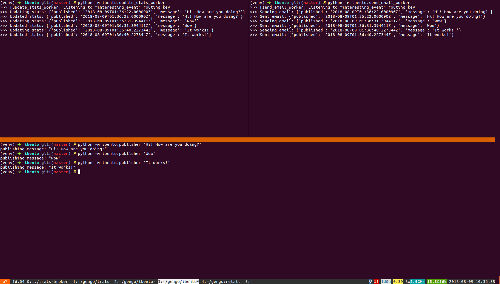

# Ibento

Prototype for using Kombu and Redis with the topic exchange pattern (pubsub).

The idea is to use this in a loosely coupled event-driven architecture, where:
- some micro-service A can publish events when something "interesting" happens
- some other micro-services (B, C...) can listen on those events, each with its own queue
- loosely coupled because A has no knowledge about B, C... and what they are doing with it. It does not send anything to B or C.
- B, C... also have no interaction: if B crashes, the handling by C will still happen

## Install

You basically just need python >=3.6 and to install the requirements:

```bash
python3.6 -m venv venv
source venv/bin/activate
pip install -r requirements.txt
```

## Run it

Launch redis (needs docker):

```bash
make up
```

Open 3 shells, make sure to activate the `venv` virtual env in it.

In the first shell, let's start a worker listening on the `interesting_event` routing key and updating some stats:
```bash
python -m ibento.update_stats_worker
```

In the second shell, let's start another worker listening on the same `interesting_event` routing key but sending an email:
```bash
python -m ibento.send_email_worker
```

In the last one, let's publish messages on this `interesting_event` routing key:
```bash
python -m ibento.publisher 'Hello World!'
```

Both workers should handle the message once on their own queue and ack it!


